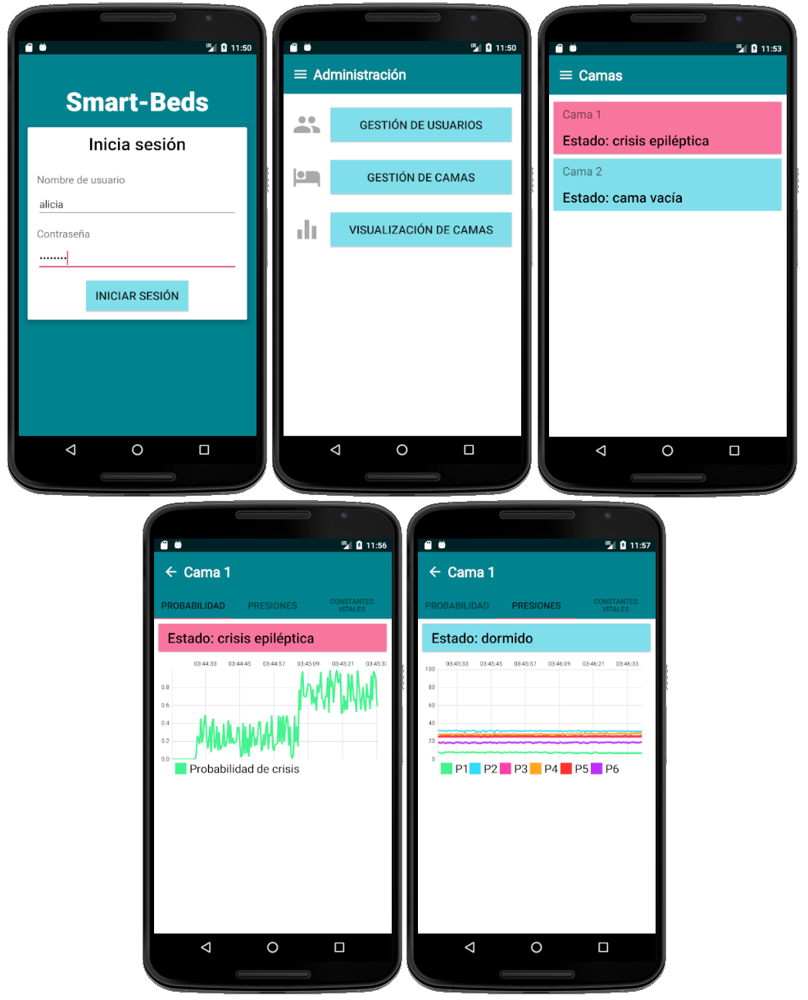

# TFG-SmartBeds

###### *__MINERÍA DE DATOS APLICADA A LA DETECCIÓN DE CRISIS EPILÉPTICAS Y APLICACIÓN ANDROID__*
Trabajo de fin de grado del grado de **Ingeniería Informática** de la **Universidad de Burgos**. 

Tutores: **Álvar Arnaiz González** y **José Francisco Diez Pastor**

---

### Resumen: 

Las crisis epilépticas son episodios caracterizados por convulsiones musculares y pérdida de la consciencia, causados por un desorden neuronal. Para pacientes con epilepsia crónica, la detección inmediata de una crisis resulta vital para evitar consecuencias permanentes. En especial, los pacientes dependientes son especialmente vulnerables, sobre todo durante la noche cuando no cuentan con supervisión.

En este proyecto se trata de aplicar técnicas de minería de datos para generar un modelo de detección de crisis en tiempo real a partir de datos recogidos mediante una matriz de sensores de presión instalada en un colchón. Entre las técnicas que se emplean en este proyecto se engloban la extracción de características de series temporales, la selección de atributos mediante algoritmos genéticos y el uso de diferentes ensembles para la generación del modelo.

Adicionalmente, se desarrolló una aplicación de Android para mostrar la aplicabilidad de este modelo.

---

### Abstract: 

Epileptic seizures are episodes characterized by muscular convulsions and loss of consciousness, caused by a neuronal disorder. For patients with chronic epilepsy, the immediate detection of a seizure is vital to avoid permanent consequences. 
In particular, dependent patients are more vulnerable, especially during the night when they do not have supervision.

In this project we try to apply data mining techniques to generate a real-time seizure detection model based on data collected through a matrix of pressure sensors installed in a mattress. The techniques used in this project include the extraction of time series features, the selection of attributes using genetic algorithms and the use of different ensembles for the generation of the model.

Additionally, an Android application was developed to show the applicability of the model.

---

### Este respositorio contiene: 

- notebooks con los experimentos realizados en la carpeta **jupyter notebooks**.
- proyecto de Adroid Studio con el código de la aplicación en la carpeta **android**.
- memoria del proyecto, anexos y cuderno de investigación en la carpeta **doc**. 

---

### Instalación de la aplicación de Android: 

El archivo .apk para la instalación y la distribución de la aplicación se encuentra en la carpeta **/android/app/release**

